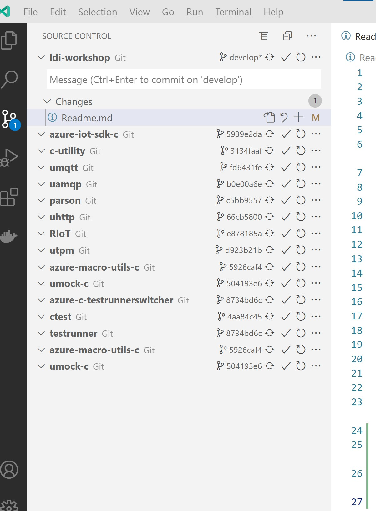

# 

Usefull cmds

```
git clone --recurse-submodules https://github.com/senssei/ldi-workshop.git 

https://apps.azureiotcentral.com/

https://www.python.org/downloads/
https://git-scm.com/downloads

curl -sL https://aka.ms/InstallAzureCLIDeb | sudo bash
az extension add --name azure-iot
az login --allow-no-subscriptions


https://code.visualstudio.com/
espressif.esp-idf-extension
ms-vscode.cpptools
espressif.esp-idf-extension

https://raw.githubusercontent.com/Azure/dps-keygen/master/bin/windows/dps_cstr.zip

C:\r\ldi-workshop\02-firmware\azure-iot-sdk-c>git submodule update --init
C:\r\ldi-workshop\02-firmware\azure-iot-sdk-c\c-utility>git submodule update --init

```



